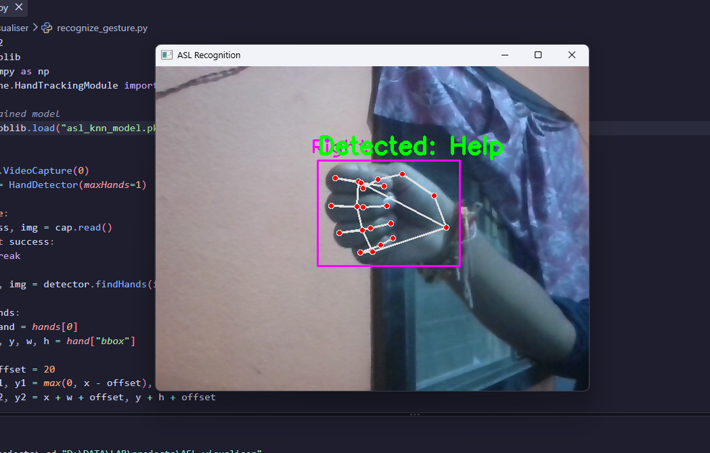

# ASL Visualizer

## Overview

ASL Visualizer is a real-time Computer Vision and Machine Learning project that recognizes predefined American Sign Language (ASL) hand gestures using a webcam.

The system captures live video, detects the user's hand, processes the detected hand gesture, and uses a K-Nearest Neighbors (KNN) machine learning model to predict the corresponding ASL sign.

The project demonstrates the application of computer vision, hand tracking, image processing, and machine learning for real-time gesture recognition.

## Problem Statement

Communication can be difficult between people who use American Sign Language (ASL) and people who are not familiar with sign language.

The objective of this project is to develop a computer vision-based system that can recognize predefined ASL hand gestures from a webcam and display the predicted gesture in real time.

## Objectives

- Detect a hand from a live webcam feed.
- Track the detected hand using computer vision techniques.
- Process the detected hand gesture for classification.
- Recognize predefined ASL gestures using a KNN classifier.
- Display the predicted gesture in real time.

## Features

- Real-time webcam input
- Hand detection and tracking
- Hand gesture recognition
- KNN-based classification
- Real-time ASL prediction
- Visual display of the recognized gesture

## Technologies Used

- Python
- OpenCV
- CVZone
- MediaPipe
- NumPy
- Scikit-learn
- Joblib
- K-Nearest Neighbors (KNN)

## System Workflow

```text
Webcam Input
     ↓
Hand Detection
     ↓
Hand Tracking
     ↓
Gesture Processing
     ↓
KNN Classification
     ↓
ASL Prediction
     ↓
Display Result
```

## Project Structure

```text
Computer_vision/
│
├── Data/
├── screenshots/
├── asl_knn_model.pkl
├── hand_tracking.py
├── recognize_gesture.py
├── train.py
├── train_model.py
├── requirements.txt
├── README.md
└── statement.md
```

## Model

The project uses a K-Nearest Neighbors (KNN) classifier for gesture recognition.

The model is trained using ASL gesture samples. During real-time operation, the detected hand gesture is processed and provided to the trained classifier, which predicts the corresponding ASL gesture.

### Why KNN?

KNN is a simple supervised machine learning algorithm that classifies an input based on the closest training samples. It is used in this project to classify the extracted gesture features into the supported ASL gesture classes.

## Installation

### 1. Clone the repository

```bash
git clone https://github.com/SleepDeprivedShi/Computer_vision.git
cd Computer_vision
```

### 2. Install dependencies

```bash
pip install -r requirements.txt
```

## How to Run

Run the real-time gesture recognition program:

```bash
python recognize_gesture.py
```

Allow the application to access your webcam and place your hand in front of the camera.

The system will detect the hand gesture and display the predicted ASL sign.

## Dataset

The model was trained using ASL gesture samples. The trained model is included in the repository for real-time recognition.

The complete training dataset may not be included in the repository due to its size.

## Testing

The system can be tested by:

1. Starting the application.
2. Allowing webcam access.
3. Showing a supported ASL gesture to the camera.
4. Observing the predicted gesture displayed by the application.
5. Testing multiple supported gestures.

Testing focuses on whether the system correctly detects the hand and recognizes the supported ASL gestures.

## Screenshots

Screenshots of the working application are provided in the `screenshots/` directory.

### Real-Time Gesture Recognition



> If the screenshot filename differs, replace `recognition.png` with the actual filename in the `screenshots` folder.

## Limitations

- The system recognizes only the gestures included in the trained model.
- Recognition performance can be affected by lighting and background conditions.
- Hand positioning and camera quality can affect detection.
- The system is designed for predefined ASL gestures rather than complete sign-language sentences.

## Future Enhancements

- Support for more ASL gestures.
- Improved recognition accuracy.
- Continuous sign-language recognition.
- Sentence-level prediction.
- Improved robustness under different lighting and backgrounds.

## References

- OpenCV Documentation
- CVZone Documentation
- MediaPipe Documentation
- Scikit-learn Documentation

## Author

**Shivansh Sinha**

B.Tech Computer Science and Engineering  
Specialization: Artificial Intelligence and Machine Learning  
VIT Bhopal University
